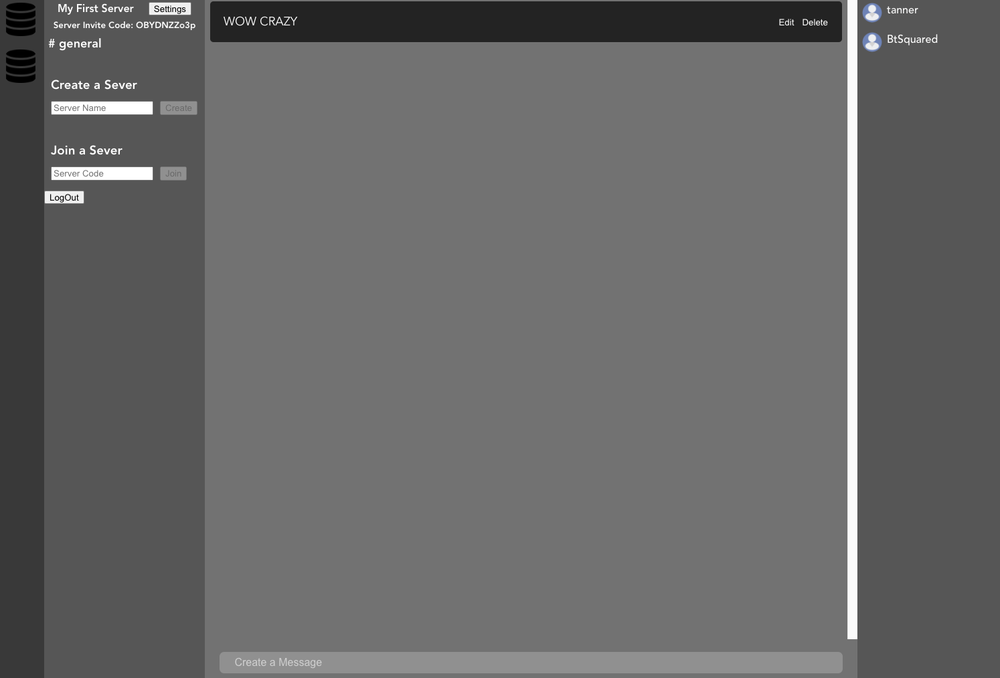
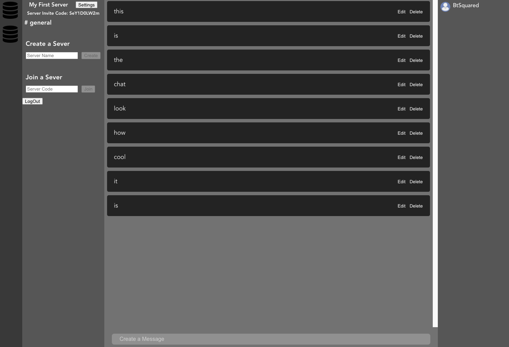

# CommBase

## Date: 10/11/2021

### By: Tanner Mitchell

[Github](https://github.com/BtSquared) | [LinkedIn](https://www.linkedin.com/in/tanner-mitchell-836130152/) 

***Description***

a platform for all your communication needs with user created and maintained servers create and manage your own community to your own wants and needs 

***Technologies Used***
 - Vue
 - Express
 - Mongoose
 - MongoDB
 - AWS S3 Bucket

***Getting Started***

  you will be presented with a Log In and regestry page when at the page either register or sign in if you already have a account. After logging in, the user will be able to send messages in servers they are currently in or create or join a server.

***Screenshots***

***future updates***

- [ ] UI changes
- [ ] auth0 integreation
- [ ] websockets
- [ ] Direct messages

***Credits***

- server defualt icon made by <a href="https://www.flaticon.com/authors/webalys" title="Webalys">Webalys</a> from www.flaticon.com
- user defualt icon made by <a href="https://www.flaticon.com/authors/flat-icons" title="Flat Icons">Flat Icons</a> from www.flaticon.com